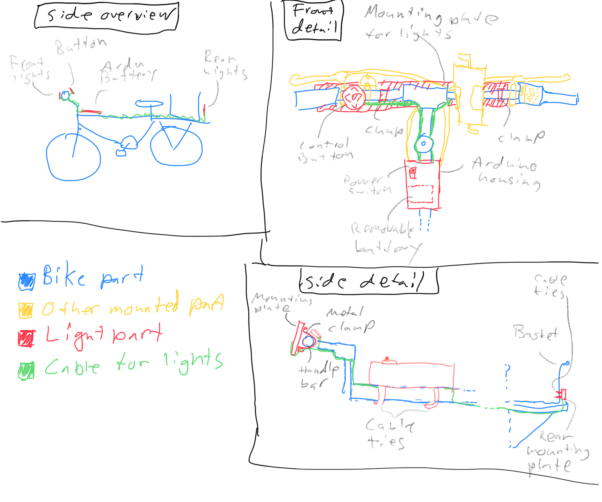

# Nevyn's Bike Lights v2

Front and rear light strips using NeoPixels, with left and right turning indicator
animations.

## Wiring

### Buttons

Voxar's buttons have these wires:

* striped: ground
* blue: down/stop (pin 9)
* green: right (pin 8)
* brown: front (pin 10)
* orage: left (pin 7)