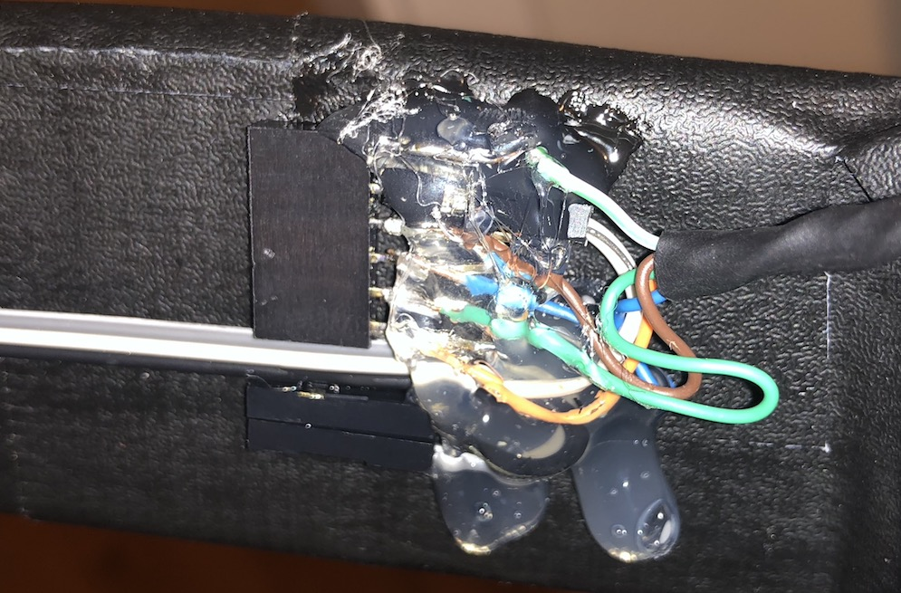

# Nevyn's Bike Lights v2

Front and rear light strips using NeoPixels, with left and right turning indicator
animations.

## Wiring

Need to update this diagram because it's mostly wrong :P Changes:

* Buttons go to ground, not 5v
* there is no center button
* buttons go to 7, 8, 9, 10 (left, right, down, up)
* Front LEDs are on pin 5
* Rear LEDS are on pin 6
* Lights go through 5v, not Vin
* there's about 500ohm resistor between lights and their data pins (5 and 6)

Haven't decided how to power this yet... Plan 1 is a 9v rechargeable battery. Plan 2 is a very
small motorcycle battery.

### Buttons

Voxar's buttons have these wires:

* striped: ground
* blue: down/stop (pin 9)
* green: right (pin 8)
* brown: front (pin 10)
* orage: left (pin 7)

### Headers

I'm terrible. This is terrible. Shitty surface solders, glue and duct tape
is all I was ever taught. Forgive me.

By having a header between the mounting plate for lights+button and the arduino, it's easier
to deal with each individual component if I need to disassemble or repair later.

2-pin header, bottom-to-top:

1. front light 5v+
2. front light gnd

6-pin header, bottom-to-top:

1. left button (to pin 7)
2. right button (to pin 8)
3. down/stop button (to pin 9)
4. front/headlight button (to pin 10)
5. front light signal (to pin 5)
6. gnd
